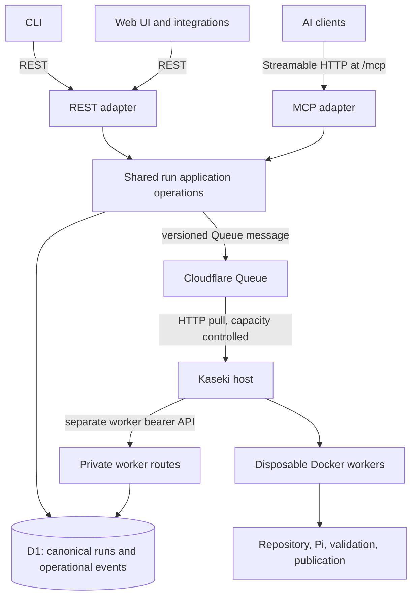
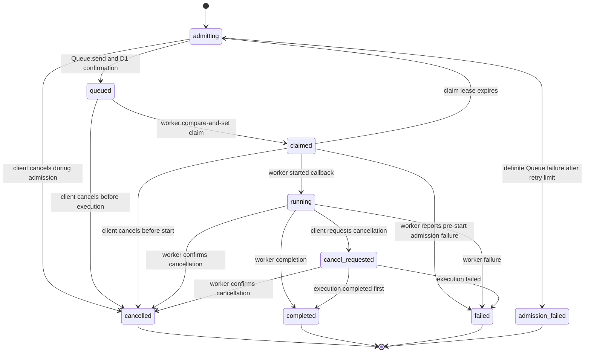

# Architecture

The REST and MCP adapters call the same run application operations. MCP does not make an internal HTTP request to `/v1`; it uses the same validation, idempotency, D1, Queue, read, event, and cancellation paths directly.

## Ownership boundary

Soyuz owns public control-plane authentication, request shape validation, run IDs, idempotent admission, canonical external state, cancellation intent, Queue publication, and operational event metadata. D1 remains the source of truth even while Kaseki is offline.

Kaseki owns host capacity, local scheduling, Docker containers, repository access, dependency preparation, Pi execution, safety/admission checks that need execution context, validation, diagnostic artifacts, and GitHub publication. Soyuz does not connect to a Kaseki host to launch work and does not attempt runtime preflight checks.

Messages are typed in Soyuz and carry `contractVersion: "1"`. The repositories do not share source code. A Kaseki consumer calls `GET /v1/worker/runs/:id` before start and while running, then reports lifecycle callbacks using the worker token.

## Run lifecycle

Requirement IDs: `LIFECYCLE-TRANSITIONS-01`, `LIFECYCLE-TERMINAL-01`, `CANCEL-CAS-01`, `WORKER-CLAIM-RECOVERY-01`, `LIFECYCLE-RACE-01`.

Transitions are checked in one domain state machine and written with a status compare-and-set. The short `claimed` lease prevents two hosts from starting one at-least-once Queue message. Kaseki must wait for the `started` callback to succeed before executing; if the host disappears before that callback, the scheduled reconciler expires the claim and republishes the same run ID. Terminal states do not return to active states. Duplicate worker callbacks are accepted when their stable event/callback ID and payload match the already stored operation.

## D1 model

`runs` holds searchable lifecycle and request metadata: repository/ref, modes, timestamps, current stage/status, worker and claim-lease identity, outcome, cancellation time, request/correlation IDs, idempotency key and request fingerprint. The validated execution request and small result summary are JSON columns. `last_heartbeat_at` and `operational_health` track execution liveness separately from lifecycle status. Indexes support newest-first history, status filtering, correlation lookup, and unique idempotency keys.

`run_events` is append-only operational history. It records status changes and compact worker events with a per-database increasing sequence, a per-run idempotency ID, timestamps, stage/step, and bounded JSON payload. It does not store raw terminal logs or arbitrary artifacts; Kaseki retains those, with R2 a future option.

## Admission across D1 and Queues

D1 and Queues do not share a transaction. Soyuz writes `admitting` and its event, awaits `RUN_QUEUE.send()`, then batches the `queued` update and event in D1. A send exception is outcome-ambiguous, so the run stays `admitting`; a one-minute scheduled reconciler retries it with the same run ID and records `admission_failed` after five unsuccessful attempts. A successful send followed by a D1 failure can also create duplicate Queue messages, so the Kaseki consumer must deduplicate and check canonical status.

Kaseki must leave a pulled message unacknowledged while Soyuz still reports `admitting`. After it reads `queued`, it claims the run with a worker-authenticated compare-and-set. It may execute only after its `started` callback moves the claim to `running`. If it sees a terminal state, it acknowledges and skips the message. A cancellation racing with publication may still leave a Queue message; canonical `cancelled` state makes it harmless.

## IDs, authentication, and compatibility

Requirement ID: `RUN-ID-UUIDV7-01`.

Soyuz generates RFC 9562 UUIDv7 IDs from the current millisecond timestamp and Web Crypto random bytes rather than Kaseki's historical `kaseki-N`. They are URL-safe and lexicographically time-sortable; D1 timestamps remain the source for deterministic history ordering. Callers must treat IDs as opaque strings.

Client and worker APIs have separate bearer secrets. Public health is unauthenticated. The MCP endpoint is client-facing and checks `CLIENT_API_TOKEN`; it does not accept `WORKER_API_TOKEN` or expose worker routes. It cannot claim, start, complete, or otherwise advance a worker run. MCP talks only to Soyuz. Kaseki remains responsible for execution-context safety, Docker, repository access, validation, diagnostics, and publication. See [the MCP interface](MCP.md) for the current bearer-token setup and OAuth follow-up.

The caller migration can be gradual: direct callers may keep using the current Kaseki API while new or selected clients submit to Soyuz. Soyuz and Kaseki remain independently deployable.

## Cloudflare references

Guidance checked against Cloudflare's current documentation on 2026-10-03:

- [Workers](https://developers.cloudflare.com/workers/)
- [Queue JavaScript APIs](https://developers.cloudflare.com/queues/configuration/javascript-apis/)
- [HTTP pull consumers](https://developers.cloudflare.com/queues/configuration/pull-consumers/)
- [Queue delivery guarantees](https://developers.cloudflare.com/queues/reference/delivery-guarantees/)
- [D1 Worker API and transactional batches](https://developers.cloudflare.com/d1/worker-api/d1-database/)
- [Workers Vitest integration](https://developers.cloudflare.com/workers/testing/vitest-integration/)
- [Wrangler commands and type generation](https://developers.cloudflare.com/workers/wrangler/commands/)
- [Cloudflare Agents stateless MCP servers](https://developers.cloudflare.com/agents/model-context-protocol/mcp-servers/)
